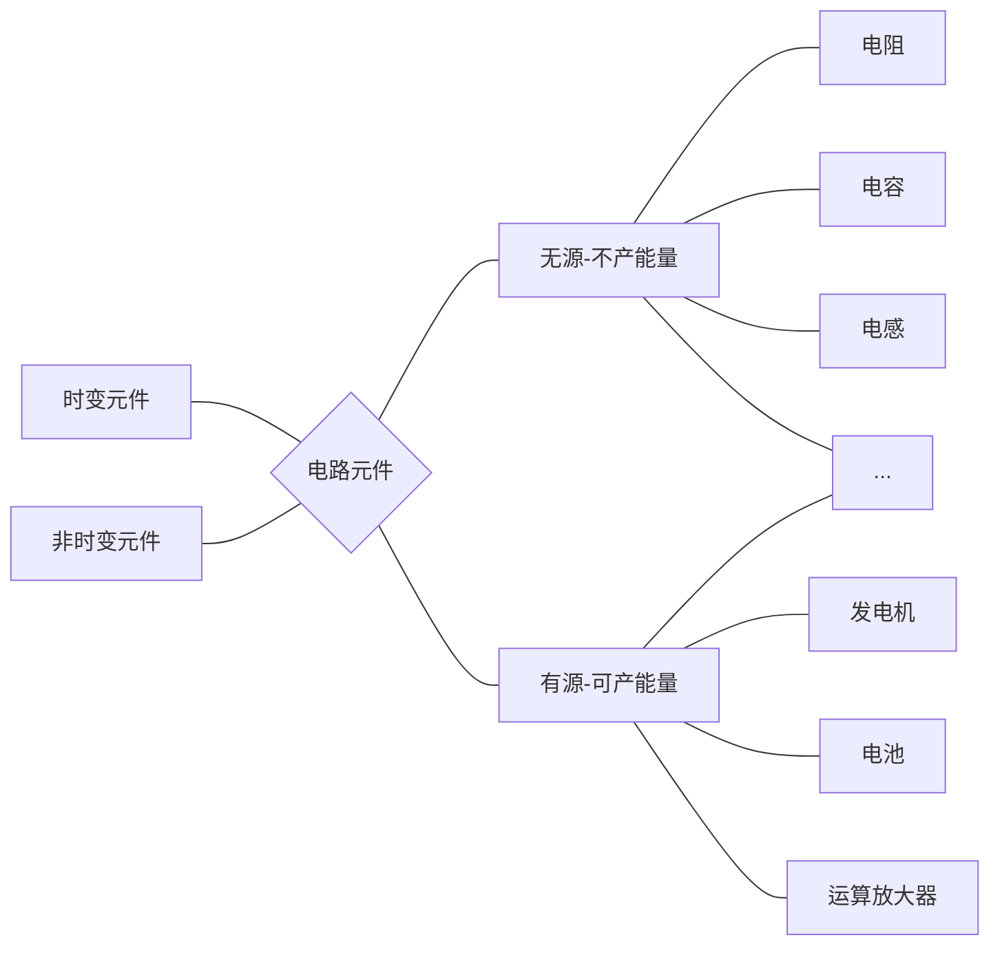

# 直流电路

## 基本概念&定律

- 电路：电子元件相互连接构成的整体
- 目标：即可以通过电路分析方法，计算机软件应用方法描述诸如下图复杂真实的电路

### 电路元件

- 

- 电阻元件

  - U-I特性（欧姆定律）

    定义R为电阻(resistance)，G为电导(conductance)。
  $$
    U\propto I\\G =\frac{1}{R}
  $$
    电导是元件传导电流的能力，度量单位为西门子(S)或欧姆
  
  - 线性&非线性，时变&非时变电阻
  
  - 非记忆元件
  
  - 消耗的能量
  
- **加在每一元件两端的电压和通过其电流的关系成为电压—电流关系(Voltage Current Relation,VCR)**

- 独立源：与其他电路元件完全无关的特定电压或电流的有源元件

  

  

*图灵电路中的另一套表示方法*

> 理想电压（电流）源可产生任意电流，理论上讲可提供无穷大能量；同时，有源元件不仅可以为电路提供功率，还可吸收功率

- 受控源：通过电路某个元件电压&电流控制
  - 电压控制电压源(VCVS)
  - 电流控制电压源(CCVS)
  - 电压控制电流源(VCCS)
  - 电流控制电压源(CCCS)

#### 应用-电视显像管

[^CRT]:阴极射线管

*现代电视显像管技术已不同于CRT*

--------

e g.若电视显像管中电子束每秒携带10^15个电子，试确定要加速该电子束使之达到4 W的功率所需电压？

解.
$$
e = -1.6\times 10^{-2}C\\
i = \frac{dq}{dt} = e\frac{dn}{dt}= -1.6\times 10^{-4}A
\\ \therefore u_0 =\frac{p}{i} =25000V 
$$

---------

**解题**

(1)明确问题

(2)表述对该问题的全部理解

(3)确定可选解集，并从中找出可能性最大的方案

(4)寻求解

(5)评价答案并验算

(6)是否满意？

### 基尔霍夫定律

#### 名词简介

- 支路

  - 电路中每个分支，一条支路流过同一个电流
  - 一个二端元件，如电流源，电阻等，适合电路的计算机辅助分析

  一般人工计算以第一个定义为准

- 节点：两个及以上支路的连接点
- 回路：平面电路中的任意闭合路径
- 网孔：**平面**电路中不含支路的回路

> 一个四面体的边组成的电路共几个网孔？
>
> 3，需在平面内即压扁后分析

#### 基尔霍夫电流定律

